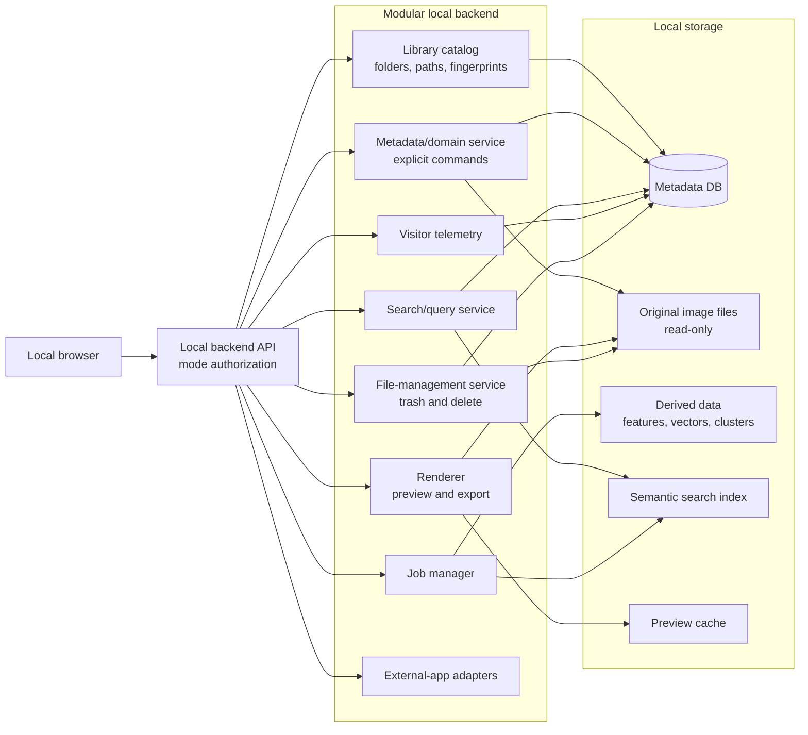
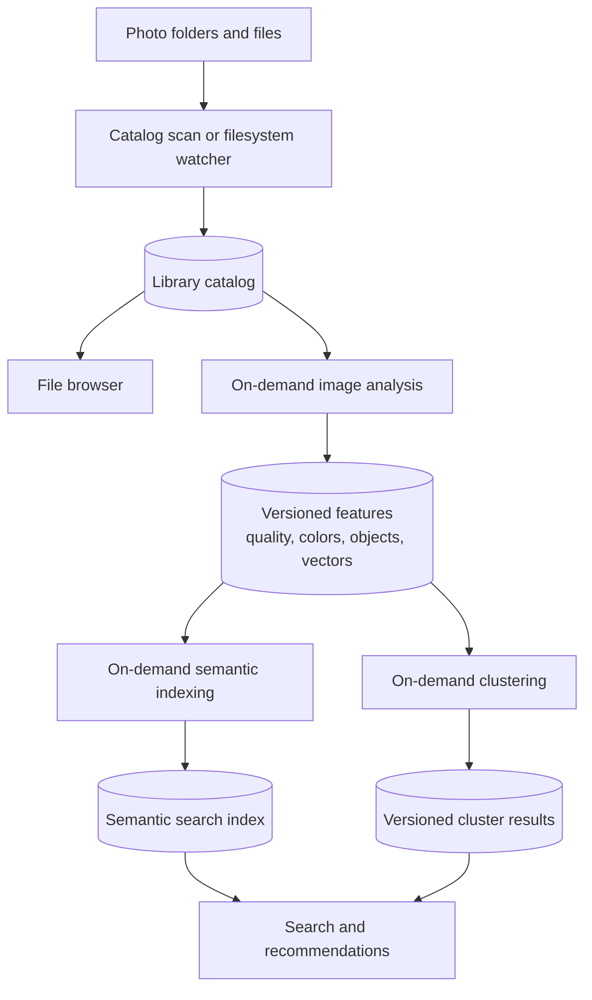
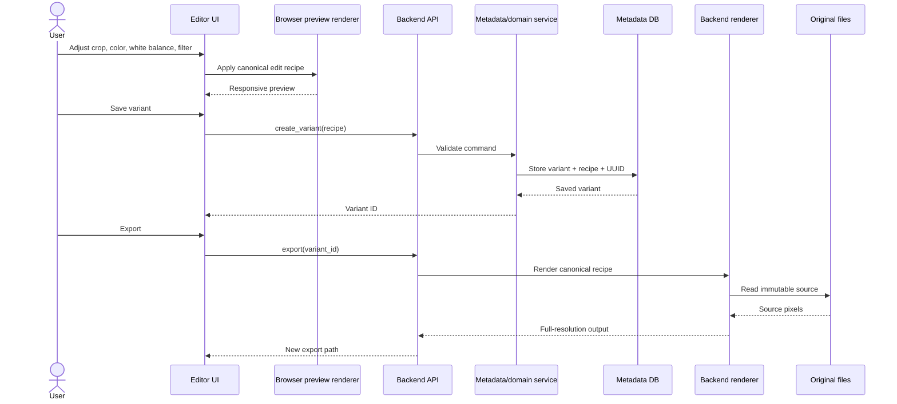
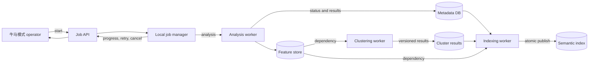
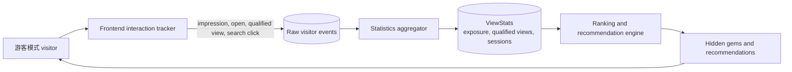
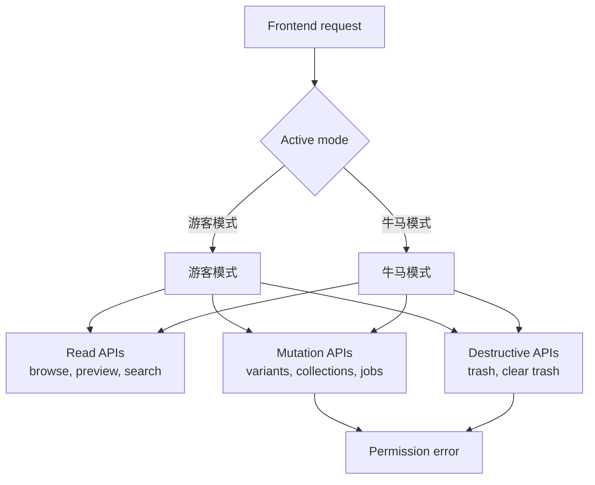

# No Waste Album — Architecture Diagrams

These diagrams are the visual companion to [`DESIGN.md`](DESIGN.md).

## 1. System overview

## 2. Two indexing layers

The catalog is the fast, basic inventory needed for browsing. The semantic index is derived data and may be absent or stale without breaking the file browser.

## 3. Non-destructive editing flow

The browser renderer is optimized for interaction. The backend renderer is authoritative for full-resolution output. Both consume the same versioned recipe format.

## 4. Background pipeline flow

Workers do not directly mutate user-owned metadata. They write versioned derived results through defined job outputs.

## 5. Visitor telemetry and ranking

Raw events are retained so statistics and rankings can be recalculated when weighting or recommendation logic changes.

## 6. Access modes

The backend enforces these permissions. Frontend control hiding is only a usability feature.

## 7. Ownership boundaries

| Component | Owns | Does not own |
|---|---|---|
| Library catalog | Folder inventory, paths, fingerprints, source status | Semantic labels or recommendations |
| Metadata/domain service | Validated user mutations and edit recipes | ML-derived results |
| Renderer | Preview/export pixels | Variant persistence decisions |
| Telemetry service | Raw visitor events and aggregates | Ranking policy |
| Analysis workers | Versioned image features | User metadata mutations |
| Clustering worker | Versioned cluster runs | Automatic organization changes |
| Indexing worker | Search-index versions | Source-file deletion |
| File-management service | Trash, restore, permanent delete | Quality judgments |
| Recommendation engine | Ranking and recommendation results | Unconfirmed user organization |
